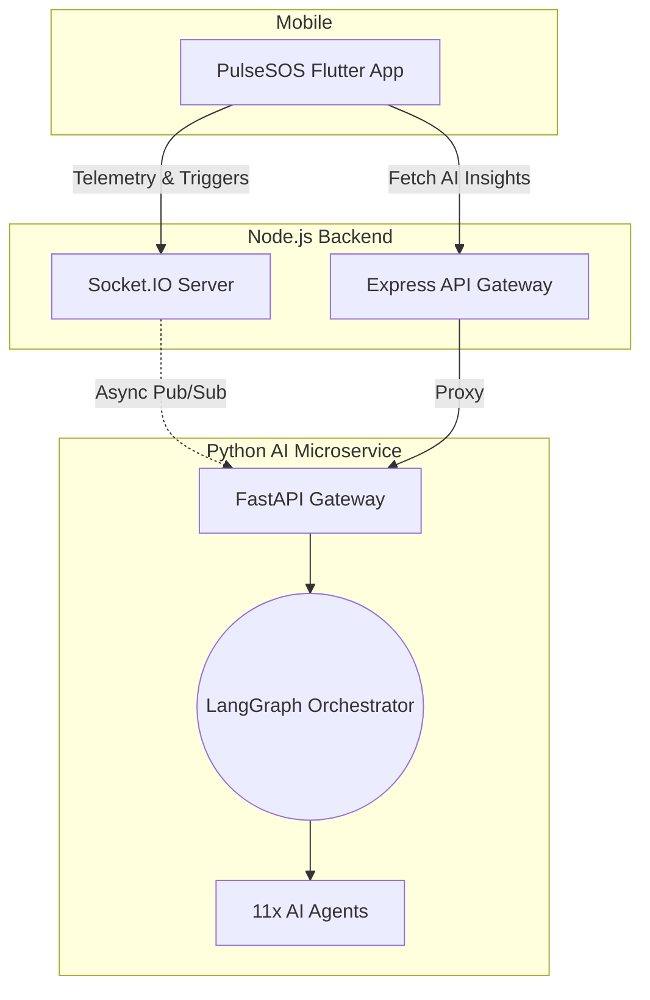

# PulseSOS — Emergency & Crowdsourced Rescue Network

PulseSOS is a production-ready, cyber-themed safety ecosystem designed to crowd-source emergency responses and synchronize real-time telemetry when a user is in immediate danger. It integrates a **Multi-Agent AI Orchestration system** that processes ongoing emergencies to provide real-time classification, risk assessment, and safety recommendations.

---

## Scope & Functionality

PulseSOS operates as an end-to-end emergency response platform. Its primary capabilities include:
- **Instant SOS Triggering**: A physical shake or button press immediately alerts nearby community responders and trusted contacts.
- **Real-Time Telemetry**: Streams high-frequency live GPS tracking to Responders over WebSockets.
- **Background Evidence Capture**: Silently records audio/video evidence locally and securely when an emergency is active.
- **AI-Powered Incident Orchestration**: As events unfold, specialized AI Agents analyze the data to provide context, language translation, and tactical safe-zone recommendations.
- **Admin Command Center**: A dashboard for operators to monitor active nodes and coordinate responders.

---

## System Architecture

PulseSOS leverages a microservice architecture optimized for low-latency emergency telemetry and asynchronous AI intelligence:



### Component Roles:
* **Mobile Client (Flutter)**: Handles background foreground services for shake detection triggers and telemetry coordinate feeds. Built with clean architecture principles.
* **API & Coordinate Server (Node.js)**: Handles JWT authentication, dynamic nearby user radius sweeps, and WebSockets for live maps.
* **AI Orchestrator (Python/FastAPI)**: Hosts the Multi-Agent framework driven by LangGraph, coordinating LangChain agents asynchronously.
* **Command Center (React)**: High-fidelity command-and-control portal showing live telemetry data feeds.

---

## The Multi-Agent AI System

The AI service runs asynchronously in the background, consuming emergency coordinates and telemetry via a Redis Pub/Sub channel. It passes active events through a LangGraph workflow that orchestrates the following twelve specialized agents:

1. **Orchestrator Agent**: Manages the main LangGraph state machine, transitions, error catchments, and node execution order.
2. **Classification Agent**: Automatically determines the incident category (e.g., medical, fire, physical threat) and calculates initial severity.
3. **Risk Assessment Agent**: Evaluates safety factors, victim vulnerability index, and threat escalation probability.
4. **Safety Recommendation Agent**: Generates exit routes and pinpoints nearest hospitals or emergency safe-zones.
5. **Incident Summarization Agent**: Produces highly condensed, actionable status logs for field responders and rescue teams.
6. **Translation Agent**: Performs real-time language localization between English, Urdu, Punjabi, and Arabic.
7. **Responder Coordination Agent**: Calculates optimal responder distribution, avoids cluster patterns, and generates ETAs.
8. **Emergency Contact Agent**: Orchestrates priority notification queues and handles automated alert messages.
9. **Fake Alert Detection Agent**: Scores incident authenticity based on user behavior and telemetry anomalies.
10. **Analytics & Pattern Agent**: Tracks historical trends and isolates geo-spatial emergency hotspots.
11. **Audio Analysis Agent (Mocked)**: Classifies acoustic anomalies (screams, crashes, gunfire) and transcribes speech. This agent utilizes mocked output to avoid massive local downloads of large audio models (e.g., PyTorch and OpenAI Whisper) for the hackathon prototype.
12. **Voice Command Agent (Mocked)**: Listens for hidden keyword activation commands under high-noise environments. This is mocked to bypass platform-dependent C++ binary dependencies.

---

## API Catalog Highlights

All endpoints require validation through the Firebase Bearer token authorization header:

| Category | Endpoint | Description |
|----------|----------|-------------|
| **Auth** | `POST /api/auth/verify-token` | Authenticates Firebase credentials |
| **Incidents** | `POST /api/incidents` | Broadcasts a new emergency alert to nearby responders |
| **Incidents** | `PUT /api/incidents/:id/location` | Receives live coordinate telemetry updates from victims |
| **AI Insights** | `GET /api/ai/insights/:id` | Fetches consolidated reports from the AI orchestrator graph |
| **Contacts** | `POST /api/contacts/notify` | Dispatches SMS and messaging tracking URLs |
| **Media** | `POST /api/media/upload` | Saves references to recorded background audio/video files |

---

## Configuration & Environment Setup

A master `.env.example` file is located at the root of the project. To configure the stack:

1. Duplicate the example file:
   ```bash
   cp .env.example .env
   ```
2. Populate the required keys:
   - `GOOGLE_API_KEY`: A valid Google AI Studio Gemini API key to power the active reasoning agents.
   - `FIREBASE_SERVICE_ACCOUNT`: Compressed JSON credential string for Firebase service account access.

---

## Docker Stack Architecture & Setup Details

The application orchestrates three primary services inside a custom bridge network called `pulsesos_network`:

1. **pulsesos_backend (Node.js API Gateway & Sockets)**
   - Port Mapping: Exposes port `5000` to the host system.
   - Purpose: Validates incoming requests, serves as the dynamic Socket.IO real-time location coordinate broadcast node, and acts as a gateway to the AI service.
   - Key Environment Variables: Requires `FIREBASE_SERVICE_ACCOUNT` (JSON format credential) to authorize endpoints using Firebase Admin SDK.

2. **pulsesos_ai_service (Python AI Microservice)**
   - Port Mapping: Exposes port `8000` to the host system.
   - Purpose: Processes incidents via a LangGraph multi-agent network triggered by Redis events.
   - Key Environment Variables: Requires `GOOGLE_API_KEY` to authenticate with Google Gemini models.

3. **pulsesos_redis (Redis Message Broker & Cache)**
   - Port Mapping: Exposes port `6379` to the host system.
   - Purpose: Acts as the low-latency pub/sub message bus between the Node.js API server and the Python AI worker. Stores conversational state memory for the agents.
   - Persistence: Utilizes a Docker volume named `redis_data` mounted at `/data` inside the alpine-based container to persist cache and queue states across restarts.

### Networking & Service Discovery
Within the Docker bridge network, services resolve one another using Docker's internal DNS system:
- The backend communicates with Redis using `redis://redis:6379`.
- The AI service communicates with Redis using `redis://redis:6379`.
- The backend proxies requests to the AI service using `http://ai_service:8000`.

---

## How to Run the Ecosystem

The entire server stack (Node.js API Gateway, Python AI Microservice, and Redis instance) is containerized via Docker.

### 1. Build and Launch Containers
Execute the following command in the project root:
```bash
docker-compose up --build -d
```
Verify the container status:
```bash
docker-compose ps
```
Monitor the logs for all services or the AI service alone:
```bash
docker-compose logs -f
docker-compose logs -f ai_service
```

### 2. Run the Mobile Client (Flutter)
Ensure you have the Flutter environment configured, then deploy to a connected device or emulator:
```bash
cd pulse_sos
flutter pub get
flutter run
```

### 3. Run the Admin Command Center (React)
To view real-time incident dashboards and mapping tables:
```bash
cd admin
npm install
npm run dev
```

---

## Troubleshooting & Build Notes

### Docker Build Failures (DNS Resolution)
If Docker fails to download system packages (e.g., APT updates from `deb.debian.org`), the internal WSL2/Docker virtual network might be experiencing DNS issues:
1. Restart your Docker Desktop instance.
2. If the issue persists, explicitly set a public DNS resolver (such as `8.8.8.8`) inside your local Docker configuration files or host network adapters.

### Python pip Installation Timeouts
On slower or restricted networks, downloading Python packages can trigger pip timeout failures:
* The `ai_service/Dockerfile` includes `--default-timeout=100` flags to prevent build processes from terminating prematurely.

### Package Version Conflicts
Strict requirements pins on LangGraph and LangChain can cause dependency resolution loops:
* Dependency declarations are left unpinned in the service's `requirements.txt` to allow the package manager to determine compatible versions.

### Heavy ML Dependencies Workaround
To ensure rapid, lightweight deployment during hackathons:
* Large speech processing dependencies (like PyTorch and local Whisper weights) have been omitted. The audio-processing and voice activation agents return structured mock responses to maintain operational speed and minimal image sizes.
